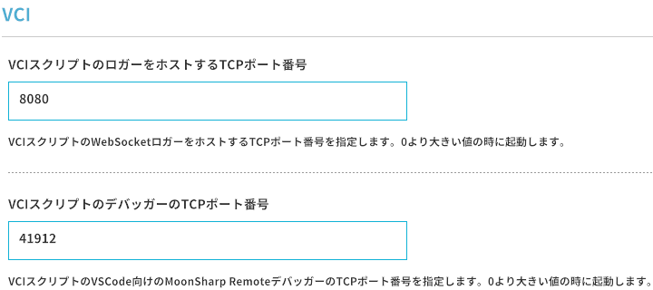

# vci-logcat

[](https://github.com/oocytanb/vci-logcat/actions/workflows/ci.yml)

[VCI](https://github.com/virtual-cast/VCI) スクリプトのログを、標準出力するためのプログラムです。

**※ 出力した実データをサンプルとして、仕様不明な状態で仮実装しています。仕様が判明したら適宜修正してお使いください。**

**※ TypeScript で再実装しました。**

[](https://www.youtube.com/watch?v=OUk8GqWlCkw)

## Installation

- [git](https://git-scm.com/)

- [Node.js](https://nodejs.org/) >= 16

```
git clone https://github.com/oocytanb/vci-logcat.git
cd vci-logcat
npm install
```

## Settings

- [VCAS クライアントの設定から、WebSocket ロガーをホストするポートを設定します。](https://virtualcast.jp/wiki/virtualcast/setting/vci/logger)

    

- `config.json` を直接編集する場合は、`websocket_console_port` の指定を追加します。

    ```
    {
        "embedded_script": {
            "websocket_console_port": 8080
        }
    }
    ```

## Usage

VCAS のワールドに入室後、本プログラムを実行します。接続に成功すると、ログを標準出力します。

```
npm start
```

オプションの使用例:  
`vci.state` と `vci.studio.shared` のログを抑制し、かつ `foo` というテキストが含まれるログを出力する場合は、
以下のオプションを指定して実行します。

```
npm start -- -s -I "foo"
```

### Options

- `-c <url>`

    接続先を指定します。既定値は `ws://localhost:8080` です。

- `-s`

    `vci.state` と `vci.studio.shared` のログを抑制します。

- `-I <text>`

    指定したテキストが含まれるログを出力します。
    対象のフィールドは (`Message`, `Item`, `Category`, `LogLevel`) です。

- `-X <text>`

    指定したテキストが含まれるログを除外して出力します。
    対象のフィールドは (`Message`, `Item`, `Category`, `LogLevel`) です。

- `-i <name>`

    指定したアイテム名が含まれるログを出力します。

- `-x <name>`

    指定したアイテム名が含まれるログを除外して出力します。

- `-r`

    正規表現での検索を有効にします。`-I` `-X` `-i` `-x` オプションに作用します。

- `-A`

    `frame: script not return` のようなシステムの警告ログをすべて出力します。

- `--output-system-status`

    システムステータスのログを出力します。

## Tips

- VCI スクリプトから `print` する内容が、以下の形式で始まる場合、ログレベルとして扱われます。
    - ログレベル + パイプ記号 (`|`) で始まる場合
        - 例: `Error | `
    - ブラケットで囲まれた `[`ログレベル`]` で始まる場合
        - 例: `[Warning]`
    - ログレベルに指定できる文字列は、次の通りです。大文字と小文字の区別はありません。
        - `Fatal`, `Warning`, `Warn`, `Info`, `Debug`, `Trace`
    - ログレベルが `Info` 以上の場合は、コンソール出力に色が付きます。

- PowerShell で出力をファイルへリダイレクトしたときに、文字化けする場合は、エンコーディングを指定すると解決するかもしれません。  
コンソールのフォントも対応するものを選びます。

    ```
    $OutputEncoding = [Console]::OutputEncoding = [Text.UTF8Encoding]::UTF8
    ```


- [VS Code](https://code.visualstudio.com/) でこのプログラムをデバッグする場合、
デバッグの構成を開き、`.vscode/launch.json` を以下のように編集します。

    ```
    {
        "version": "0.2.0",
        "configurations": [
            {
                "type": "pwa-node",
                "request": "launch",
                "name": "Launch Program",
                "skipFiles": [
                    "<node_internals>/**"
                ],
                "runtimeArgs": ["--nolazy", "-r", "ts-node/register"],
                "program": "${workspaceFolder}/src/node_cli/cli_main.ts",
                "args": ["-c", "ws://localhost:8080"]
            }
        ]
    }
    ```

## License

MIT License

## Libraries

[see dependencies](./package.json)
